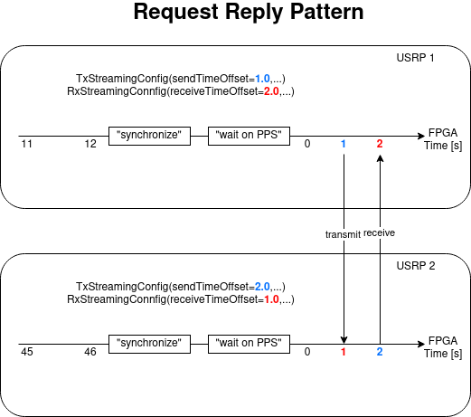

Synchronisation & Communcation Patterns
=======================================

If a :py:class:`usrp_client.system.System` consists of multiple USRPs, their clocks and their carrier frequencies
need to be synchronized. We assume that the USRPs have a `PPS in` port that accepts Pulse Per Second (PPS) signals. 
This signal is provided by an external device.

The USRPs have a built-in trigger that detects PPS signals. Once a PPS signal arrives,
the internal USRP time can be set to zero. Each USRP has an interval FPGA time. If the USRPs are synced,
the FPGA time is reset at the next PPS edge, cf. the following picture.

In the client, you need to specify ``TxStreamingConfig`` and ``RxStreamingConfig``.
The offsets determine when the signal is sent and received. Based on these offsets, you can define
your own communcation patterns. The following illustrates a Request-Reply-Pattern:

If you want to define a multi-cast pattern, the streaming configurations look as follows (pseudo-code):

.. code-block:: python

   tUsrp1 = TxStreamingConfig(sendTimeOffset=1.0, ...)

   rUsrp2 = RxStreamingConfig(receiveTimeOffset=1.0, ...)
   rUsrp3 = RxStreamingConfig(receiveTimeOffset=1.0, ...)

JCAS looks as follows:

.. code-block:: python

   tUsrp1 = TxStreamingConfig(sendTimeOffset=1.0, ...)
   rUsrp1 = RxStreamingConfig(receiveTimeOffset=1.0, ...)

   rUsrp2 = RxStreamingConfig(receiveTimeOffset=1.0, ...)

Assume you want to send a multi-cast from USRP1 to USRPs 2 and 3 and afterwards send a unicast to USRP4 from USRP1:

.. code-block:: python

   system = System()
   system.addUsrp(...)  # add your usrps here

   # multi-cast
   tUsrp1 = TxStreamingConfig(sendTimeOffset=1.0, ...)
   
   rUsrp2 = RxStreamingConfig(receiveTimeOffset=1.0, ...)
   rUsrp3 = RxStreamingConfig(receiveTimeOffset=1.0, ...)
   
   system.configureTx(usrpName="usrp1", txStreamingConfig=tUsrp1)
   
   system.configureRx(usrpName="usrp2", rxStreamingConfig=rUsrp2)
   system.configureRx(usrpName="usrp3", rxStreamingConfig=rUsrp3)
   system.execute()
   samplesMulticast = system.collect()
   
   # unicast
   
   tUsrp1 = TxStreamingConfig(sendTimeOffset=3.0, ...)
   rUsrp4 = RxStreamingConfig(receiveTimeOffset=3.0, ...)
   
   system.configureTx(usrpName="usrp1", txStreamingConfig=tUsrp1)
   system.configureRx(usrpName="usrp4", rxStreamingConfig=rUsrp4)
   system.execute()
   samplesUnicast = system.collect()