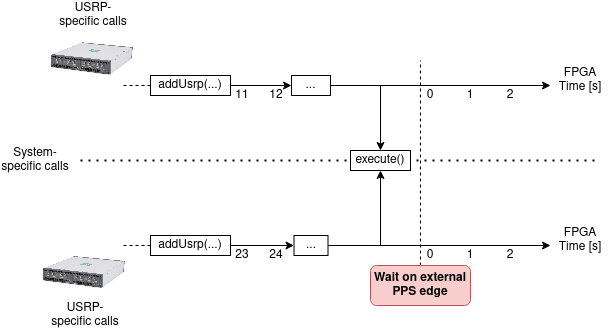
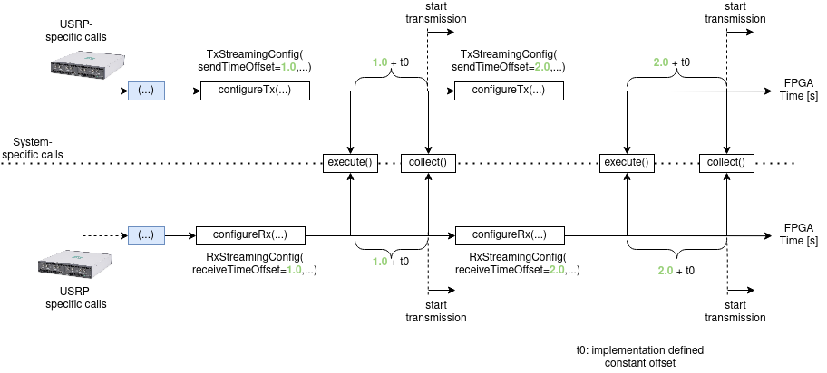

Synchronisation & Communication Patterns
========================================

If a :py:class:`usrp_client.system.System` consists of multiple USRPs, their clocks and their carrier frequencies
need to be synchronized. We assume that the USRPs have a `PPS in` port that accepts Pulse Per Second (PPS) signals. 
This signal is provided by an external device.

The USRPs have a built-in trigger that detects PPS signals. Once a PPS signal arrives,
the internal USRP time can be set to zero. Each USRP has an interval FPGA time. If the USRPs are synced,
the FPGA time is reset at the next PPS edge, cf. the following picture:

It is to be noted that there are calls on the ``System`` itself (without explicitely accessing the USRP) and there
are calls that access the USRPs within the ``System``. They need to be set in the API call.

The following picture shows the usual workflow:

In the following description, we assume the USRPs to be synchronized. 
After having created the system via ``system = System()`` and after having added the USRPs
to the system with ``addUsrp`` (in the picture, we assume two USRPs to be added), we define
their streaming configurations with the dataclasses ``TxStreamingConfig`` and ``RxStreamingConfig``.
Within the streaming configurations, we set time offsets.
In the example, we define a ``TxStreamingConfig`` with ``sendTimeOffset=1.0`` and a ``RxStreamingConfig``
with ``receiveTimeOffset=1.0``. Afterwards, the ``execute()`` function is called, checking if 
the USRPs are in sync.

After having defined the streaming configuration, ``execute()`` needs to be called. In order to
collect the actual samples ``collect()`` needs to be called afterwards, which is a blocking call.
It waits for transmission to be finished. The offsets defined in the streaming configurations (highlighted
in green in the image) are with respect to the ``execute()`` call. On top of the defined offsets,
a implementation-defined constant time offset ``t0`` is added.

As depicted, the system can be reused if multiple packages need to be transmitted.

Communication Patterns
~~~~~~~~~~~~~~~~~~~~~~

Based on these offsets, you can define
your own communication patterns. The following illustrates a Request-Reply-Pattern:

.. image:: images/request_reply_pattern.png

If you want to define a multi-cast pattern, the streaming configurations look as follows (pseudo-code):

.. code-block:: python

   tUsrp1 = TxStreamingConfig(sendTimeOffset=1.0, ...)

   rUsrp2 = RxStreamingConfig(receiveTimeOffset=1.0, ...)
   rUsrp3 = RxStreamingConfig(receiveTimeOffset=1.0, ...)

JCAS looks as follows:

.. code-block:: python

   tUsrp1 = TxStreamingConfig(sendTimeOffset=1.0, ...)
   rUsrp1 = RxStreamingConfig(receiveTimeOffset=1.0, ...)

   rUsrp2 = RxStreamingConfig(receiveTimeOffset=1.0, ...)

Assume you want to send a multi-cast from USRP1 to USRPs 2 and 3 and afterwards send a unicast to USRP4 from USRP1:

.. code-block:: python

   system = System()
   system.addUsrp(...)  # add your usrps here

   # multi-cast
   tUsrp1 = TxStreamingConfig(sendTimeOffset=1.0, ...)
   
   rUsrp2 = RxStreamingConfig(receiveTimeOffset=1.0, ...)
   rUsrp3 = RxStreamingConfig(receiveTimeOffset=1.0, ...)
   
   system.configureTx(usrpName="usrp1", txStreamingConfig=tUsrp1)
   
   system.configureRx(usrpName="usrp2", rxStreamingConfig=rUsrp2)
   system.configureRx(usrpName="usrp3", rxStreamingConfig=rUsrp3)
   system.execute()
   samplesMulticast = system.collect()
   
   # unicast
   
   tUsrp1 = TxStreamingConfig(sendTimeOffset=3.0, ...)
   rUsrp4 = RxStreamingConfig(receiveTimeOffset=3.0, ...)
   
   system.configureTx(usrpName="usrp1", txStreamingConfig=tUsrp1)
   system.configureRx(usrpName="usrp4", rxStreamingConfig=rUsrp4)
   system.execute()
   samplesUnicast = system.collect()